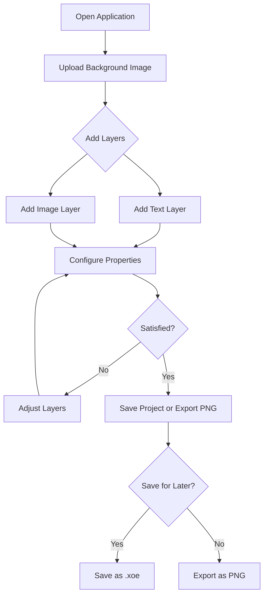
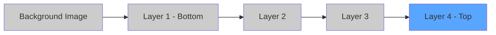
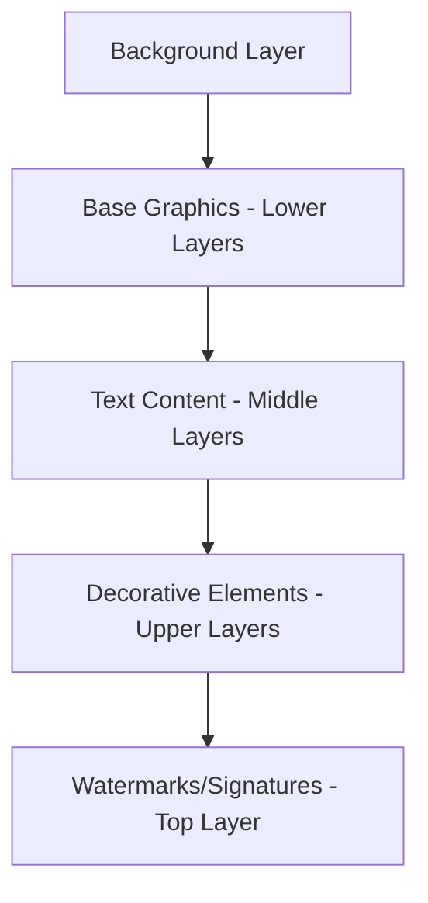
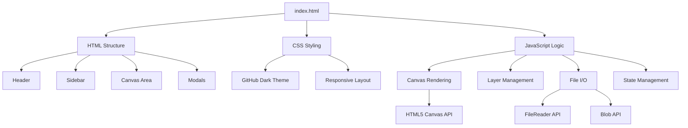
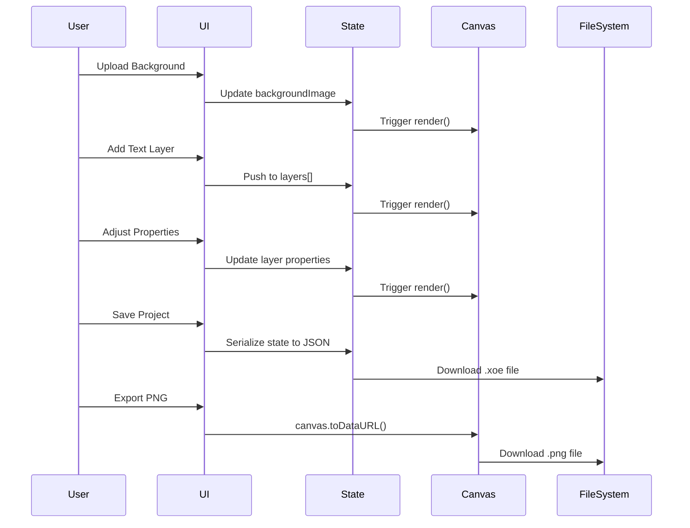

# xsukax Overlay Studio

A privacy-focused, client-side web application for creating professional image overlays with text and image layers. Built as a single HTML file with zero external dependencies, ensuring complete data sovereignty and offline functionality.


[](https://www.gnu.org/licenses/gpl-3.0)
[](https://developer.mozilla.org/en-US/docs/Web/HTML)
[](https://developer.mozilla.org/en-US/docs/Web/JavaScript)
[](https://developer.mozilla.org/en-US/docs/Web/API/Canvas_API)

## 📋 Project Overview

xsukax Overlay Studio is a browser-based image composition tool designed for content creators, streamers, designers, and anyone who needs to add professional overlays to images. The application provides an intuitive interface for layering text and images onto a background, with comprehensive controls for positioning, styling, and transforming each element.

Built entirely with vanilla JavaScript and HTML5 Canvas, the application runs completely in the browser without requiring any server-side processing, external libraries, or internet connection after initial load. This architecture ensures maximum privacy, security, and performance.

### Core Capabilities

- **Background Image Management**: Upload and use any image as a canvas background
- **Text Layer System**: Add multiple text overlays with extensive typography controls
- **Image Layer System**: Overlay additional images with precise positioning and transformations
- **Advanced Layer Management**: Reorder layers, toggle visibility, and fine-tune each element independently
- **Project Persistence**: Save complete projects as portable `.xoe` files for future editing
- **High-Quality Export**: Generate pixel-perfect PNG exports of your final compositions

## 🔒 Security and Privacy Benefits

xsukax Overlay Studio is architected with a privacy-first philosophy, ensuring that user data never leaves the local environment:

### Client-Side Architecture

- **Zero Server Communication**: All image processing, layer management, and rendering occur entirely within the browser's JavaScript runtime
- **No External Dependencies**: The application contains no CDN links, third-party scripts, or external resource requests
- **No Telemetry or Analytics**: Absolutely no user tracking, behavior monitoring, or data collection mechanisms
- **No Authentication Required**: No user accounts, login systems, or cloud storage integrations

### Data Sovereignty

- **Local-Only Storage**: Images are processed and stored exclusively in browser memory during active sessions
- **No Automatic Uploads**: Files are never transmitted to external servers or cloud services
- **User-Controlled Persistence**: Project data is saved only when explicitly requested by the user, as local `.xoe` files
- **Portable Project Format**: Project files are JSON-based and can be archived, backed up, or version-controlled by the user

### Offline Functionality

- **Complete Offline Operation**: Once loaded, the application functions without internet connectivity
- **No Remote Resource Dependencies**: All fonts, icons, and UI elements are embedded or use system defaults
- **Airgapped Environment Compatible**: Suitable for use in isolated networks or high-security environments

### Browser Security Model

- **Sandboxed Execution**: Runs within the browser's security sandbox with standard web API protections
- **FileReader API**: Safely processes user-selected files through browser-native APIs
- **Canvas Isolation**: Image processing occurs in isolated Canvas contexts without DOM exposure

## ✨ Features and Advantages

### Layer Management

- **Unified Layer System**: Manage all text and image layers in a single, intuitive stack
- **Visual Layer Hierarchy**: Clearly labeled layers with order indicators (L1, L2, L3, etc.)
- **Flexible Reordering**: Move layers up or down in the stack with single-click controls
- **Toggle Visibility**: Enable or disable layers without deletion for iterative design
- **Individual Layer Controls**: Each layer has dedicated controls for all properties

### Text Overlay Capabilities

- **Rich Typography**: Support for 24+ common font families including serif, sans-serif, and monospace options
- **Font Styling**: Bold, italic, and underline text decorations
- **Precise Positioning**: Numeric X/Y coordinate controls with sub-pixel accuracy
- **Font Size Control**: Adjustable from 1px to 500px for any design requirement
- **Color Customization**: Full color picker with hex color support
- **Rotation**: 360-degree rotation with negative and positive angle support
- **Flip Transformations**: Independent horizontal and vertical flipping
- **Opacity Control**: Fine-grained transparency from 0 (invisible) to 255 (opaque)

### Image Overlay Capabilities

- **Multiple Image Support**: Add unlimited image overlays to compositions
- **Aspect Ratio Preservation**: Automatic height calculation maintains original proportions
- **Width Scaling**: Resize images from 1px to 9999px width
- **Rotation and Flipping**: Same transformation controls as text layers
- **Opacity Control**: Blend images seamlessly with adjustable transparency

### Project Management

- **JSON-Based Format**: Projects saved as human-readable JSON with `.xoe` extension
- **Version Compatibility**: Supports both v1.0 (legacy) and v2.0 project formats
- **Embedded Assets**: Background and overlay images stored as Base64 data URIs within project files
- **Metadata Preservation**: Stores canvas dimensions, layer properties, and project metadata
- **Cross-Platform Compatibility**: Project files work identically across Windows, macOS, and Linux

### User Interface

- **Dark Theme Design**: Modern, GitHub-inspired dark UI optimized for extended use
- **Responsive Layout**: Adapts to different screen sizes with collapsible sidebar
- **Checkerboard Canvas**: Transparent background visualization for precise layer positioning
- **Real-Time Preview**: Instant visual feedback as properties are adjusted
- **Keyboard-Friendly**: Standard form controls for efficient keyboard navigation

### Export Options

- **PNG Export**: High-quality raster export with full transparency support
- **Canvas Resolution**: Exports at original background image resolution
- **Sanitized Filenames**: Automatic filename generation from project name

## 💻 Installation Instructions

xsukax Overlay Studio requires no traditional installation process. Follow these steps to begin using the application:

### Method 1: Direct Download

1. **Download the Application**:
   ```bash
   git clone https://github.com/xsukax/xsukax-Overlay-Studio.git
   cd xsukax-Overlay-Studio
   ```

2. **Open in Browser**:
   - Locate the `index.html` file in the downloaded directory
   - Double-click the file to open it in your default web browser
   - Alternatively, right-click and select "Open with" to choose a specific browser

### Method 2: Single File Usage

1. **Download Only the HTML File**:
   - Navigate to the repository on GitHub
   - Open `index.html` and click the "Raw" button
   - Save the file (Ctrl+S or Cmd+S) to your desired location

2. **Launch the Application**:
   - Simply open the saved HTML file in any modern web browser

### System Requirements

- **Browser**: Any modern browser supporting HTML5 Canvas API
  - Chrome 90+ (recommended)
  - Firefox 88+
  - Safari 14+
  - Edge 90+
- **Operating System**: Windows 7+, macOS 10.12+, Linux (any modern distribution)
- **Memory**: 2GB RAM minimum (4GB+ recommended for large images)
- **Storage**: Minimal (single ~50KB HTML file)

### No Server Required

The application runs entirely in the browser without requiring:
- Web server setup
- Node.js or npm
- PHP, Python, or other server-side runtimes
- Database configuration
- Environment variables

## 📖 Usage Guide

### Basic Workflow



### Step-by-Step Instructions

#### 1. Loading a Background Image

The background image serves as the canvas for your composition:

1. Click the **"Choose Image"** button in the "Background Image" section
2. Select an image file from your computer (JPG, PNG, GIF, WebP supported)
3. The canvas will automatically resize to match the background image dimensions
4. Image information will display in the "Project" section

**Note**: All subsequent layers will be positioned relative to this background.

#### 2. Adding Text Overlays

Create text elements with full typographic control:

1. Click the **"+ Text"** button in the "Layers" section
2. A new text layer appears with default properties
3. Configure the text layer using the following controls:

   **Content and Positioning**:
   - **Text**: Enter the desired text content
   - **X Position**: Horizontal position in pixels (negative values allowed)
   - **Y Position**: Vertical position in pixels (negative values allowed)

   **Typography**:
   - **Font Size**: Size in pixels (1-500px range)
   - **Font Family**: Select from dropdown of 24 common fonts
   - **Text Style**: Toggle Bold, Italic, and Underline independently
   - **Color**: Click the color picker to select any hex color

   **Transformations**:
   - **Rotation**: Angle in degrees (-360° to 360°)
   - **Flip H**: Horizontal flip (mirror)
   - **Flip V**: Vertical flip (invert)
   - **Opacity**: Transparency level (0 = invisible, 255 = opaque)

#### 3. Adding Image Overlays

Layer additional images onto your composition:

1. Click the **"+ Image"** button in the "Layers" section
2. The image overlay modal appears
3. Click **"Choose Image"** and select an image file
4. The image layer is added with default properties
5. Configure the image layer:

   **Positioning and Sizing**:
   - **X Position**: Horizontal position in pixels
   - **Y Position**: Vertical position in pixels
   - **Width**: Image width in pixels (height auto-calculated to maintain aspect ratio)

   **Transformations**:
   - **Rotation**: Angle in degrees
   - **Flip H/V**: Horizontal and vertical flipping
   - **Opacity**: Transparency control

#### 4. Managing Layer Order

Layers are rendered from bottom to top (L1 is underneath L2, etc.):



**Layer Controls**:
- **↑ Button**: Move layer up one position (toward top)
- **↓ Button**: Move layer down one position (toward bottom)
- **Toggle Switch**: Enable or disable layer visibility
- **× Button**: Permanently delete the layer

#### 5. Saving Projects

Preserve your work for future editing:

1. Click **"💾 Save Project"** in the header
2. A `.xoe` file is automatically downloaded
3. The filename is based on your project name (default: "untitled_project.xoe")
4. Store this file in your preferred location

**Project File Contents**:
- Complete canvas configuration
- All layer properties and order
- Embedded background and overlay images (Base64)
- Metadata and version information

#### 6. Loading Saved Projects

Resume work on previously saved compositions:

1. Click **"📂 Load Project"** in the header
2. Click **"Choose .xoe file"** in the modal
3. Select your saved project file
4. The application restores:
   - Background image
   - All layers with exact properties
   - Layer order and visibility states

**Compatibility**: The application supports both v1.0 and v2.0 project formats for backward compatibility.

#### 7. Exporting Final Images

Generate high-quality PNG files:

1. Ensure all layers are configured as desired
2. Toggle off any layers you don't want in the final export
3. Click **"📥 Export PNG"** in the header
4. A PNG file downloads with the current canvas composition
5. The export resolution matches the background image dimensions

### Advanced Techniques

#### Precise Layer Positioning

For pixel-perfect alignment:
- Use negative coordinates to position elements partially off-canvas
- Combine rotation with flipping for complex transformations
- Adjust opacity for layering effects and watermarks

#### Layer Organization Strategy



Organize layers logically:
1. Keep background-related elements at the bottom
2. Place primary content in the middle
3. Position decorative overlays near the top
4. Reserve the topmost layer for watermarks or signatures

#### Batch Processing Workflow

For multiple similar compositions:
1. Create a template project with common elements
2. Save as a base `.xoe` file
3. For each new composition:
   - Load the template
   - Replace the background image
   - Adjust layer-specific content
   - Export and save as a new project

### Keyboard Shortcuts

Standard browser shortcuts apply:
- **Ctrl/Cmd + S**: Triggers browser save (use "Save Project" button instead)
- **Tab**: Navigate between form controls
- **Enter**: Activate focused button
- **Escape**: Close modals (where applicable)

## 🛠️ Technical Architecture

### Application Structure



### Core Technologies

- **HTML5 Canvas**: High-performance 2D rendering engine
- **FileReader API**: Secure client-side file reading
- **Blob API**: Binary data handling for exports
- **Canvas 2D Context**: Drawing operations and transformations
- **Base64 Encoding**: Image data serialization for project files

### Data Flow



### State Management

The application maintains state through JavaScript variables:

```javascript
let projectName = 'Untitled Project';
let backgroundImage = null;           // Image object
let backgroundImageData = null;       // Base64 data URI
let layers = [];                      // Array of layer objects
let nextLayerId = 1;                  // Auto-incrementing ID
```

### Layer Object Schema

**Text Layer**:
```json
{
  "id": 1,
  "type": "text",
  "enabled": true,
  "text": "Sample Text",
  "x": 50,
  "y": 50,
  "fontSize": 48,
  "fontFamily": "Arial",
  "color": "#FF6B6B",
  "rotation": 0,
  "flipHorizontal": false,
  "flipVertical": false,
  "opacity": 255,
  "bold": false,
  "italic": false,
  "underline": false
}
```

**Image Layer**:
```json
{
  "id": 2,
  "type": "image",
  "enabled": true,
  "imageData": "data:image/png;base64,...",
  "imageName": "overlay.png",
  "x": 50,
  "y": 50,
  "width": 150,
  "rotation": 0,
  "flipHorizontal": false,
  "flipVertical": false,
  "opacity": 255
}
```

## 🤝 Contributing

Contributions are welcome and encouraged! Please follow these guidelines:

### Reporting Issues

When reporting bugs or requesting features:
1. Check existing issues to avoid duplicates
2. Provide a clear, descriptive title
3. Include steps to reproduce (for bugs)
4. Specify browser and operating system
5. Attach screenshots or example `.xoe` files if relevant

### Pull Requests

1. Fork the repository
2. Create a feature branch: `git checkout -b feature/your-feature-name`
3. Make your changes with clear, concise commits
4. Test thoroughly across different browsers
5. Update documentation if necessary
6. Submit a pull request with a detailed description

### Development Guidelines

- Maintain the single-file architecture
- Avoid introducing external dependencies
- Preserve privacy-first design principles
- Follow existing code style and conventions
- Ensure backward compatibility with existing `.xoe` files
- Test with various image formats and sizes

### Code Style

- Use meaningful variable and function names
- Add comments for complex logic
- Maintain consistent indentation (4 spaces)
- Use ES6+ JavaScript features where appropriate
- Keep functions focused and modular

## 📄 Licensing Information

This project is licensed under the **GNU General Public License v3.0** (GPL-3.0).

### Key License Terms

**Freedom to Use**: You may use this software for any purpose, including commercial applications.

**Freedom to Study**: You have the right to study how the program works and adapt it to your needs. Access to the source code is a prerequisite for this.

**Freedom to Redistribute**: You may redistribute copies of the software to help others.

**Freedom to Improve**: You may distribute modified versions of the software, allowing the whole community to benefit from your improvements.

### Copyleft Provision

Any derivative works or modifications must also be distributed under GPL-3.0. This ensures that all versions of the software remain free and open source.

### License Text

The complete license text is available in the [LICENSE](LICENSE) file in the repository or at:
https://www.gnu.org/licenses/gpl-3.0.en.html

### Copyright Notice

```
xsukax Overlay Studio
Copyright (C) 2025 xsukax

This program is free software: you can redistribute it and/or modify
it under the terms of the GNU General Public License as published by
the Free Software Foundation, either version 3 of the License, or
(at your option) any later version.

This program is distributed in the hope that it will be useful,
but WITHOUT ANY WARRANTY; without even the implied warranty of
MERCHANTABILITY or FITNESS FOR A PARTICULAR PURPOSE. See the
GNU General Public License for more details.
```

## 🙏 Acknowledgments

- GitHub for design inspiration
- The open-source community for best practices and standards
- Contributors and users providing feedback and suggestions

## 📞 Support

- **Issues**: Report bugs or request features via [GitHub Issues](https://github.com/xsukax/xsukax-Overlay-Studio/issues)
- **Documentation**: Refer to this README for comprehensive guidance


---

**Made with ❤️ by the open-source community | Protecting your privacy, one layer at a time**
