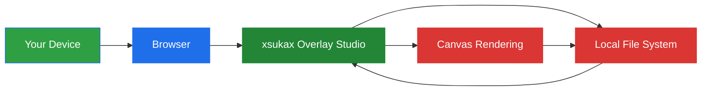
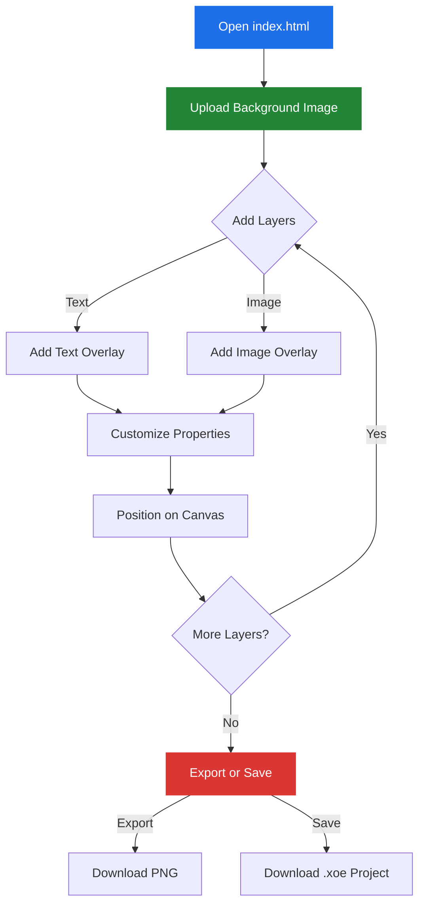
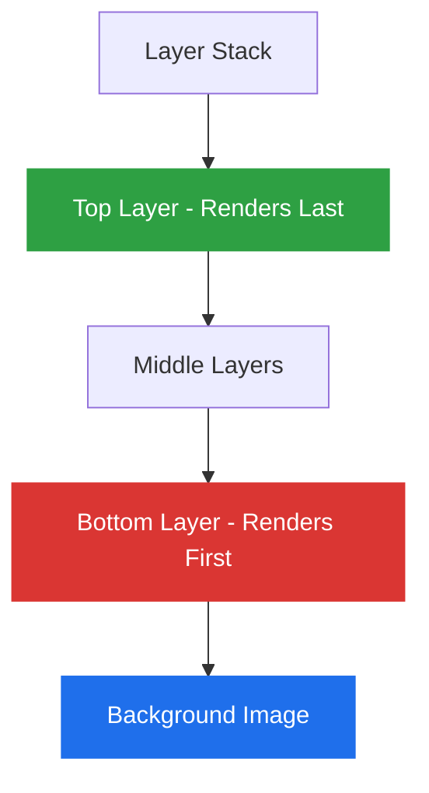
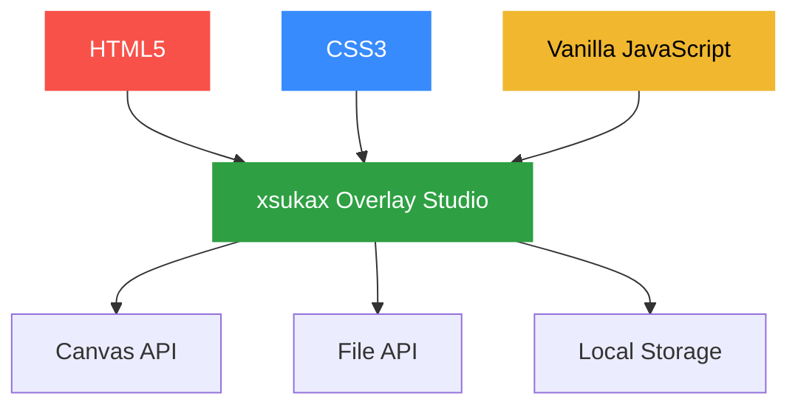
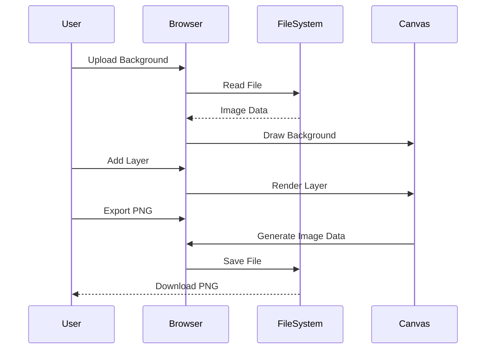

# xsukax Overlay Studio

A powerful, privacy-focused, client-side image overlay editor that runs entirely in your web browser. Create professional image compositions with text and image layers without uploading your content to any server.


## Project Overview

**xsukax Overlay Studio** is a single-file web application designed for creating sophisticated image overlays with multiple layers of text and images. Built with vanilla JavaScript and HTML5 Canvas, this tool provides a comprehensive layer-based editing system that operates entirely within your browser, ensuring complete privacy and control over your creative assets.

The application is ideal for content creators, streamers, designers, and anyone who needs to add professional overlays to images without relying on cloud-based services or installing heavy desktop software.

### Core Functionality

- **Background Image Management**: Load any image as your canvas foundation
- **Text Layer System**: Add unlimited customizable text overlays with full typography control
- **Image Layer System**: Composite multiple images with precise positioning and transformation
- **Layer Management**: Organize, reorder, and toggle visibility of all layers
- **Project Persistence**: Save and load your work in a portable `.xoe` format
- **Export Capabilities**: Generate high-quality PNG files of your final composition

## Security and Privacy Benefits

xsukax Overlay Studio is built with security and privacy as fundamental design principles:

### Complete Client-Side Processing

All image processing, manipulation, and rendering occur exclusively within your web browser. **No data ever leaves your device**. This architecture provides:

- **Zero Server Dependencies**: No backend servers, databases, or cloud storage involved
- **No Data Transmission**: Your images, text, and project files remain entirely on your local machine
- **Offline Capability**: Once loaded, the application functions without an internet connection
- **No Third-Party Services**: No external APIs, CDNs, or tracking libraries

### Privacy-First Architecture



- **No Telemetry**: Zero tracking, analytics, or usage monitoring
- **No Account Required**: No registration, login, or personal information collection
- **No Watermarks**: Your exported images are completely yours
- **Open Source Transparency**: Full source code visibility for security auditing

### Data Sovereignty

You maintain complete control over your creative work:

- Images never uploaded to external servers
- Project files stored locally with your chosen naming and location
- Exports saved directly to your device
- No retention policies or terms of service regarding your content

## Features and Advantages

### Layer-Based Editing System

- **Unlimited Layers**: Add as many text and image layers as needed
- **Visual Layer Management**: Intuitive interface showing all layers with real-time previews
- **Layer Reordering**: Move layers up or down in the stack with arrow controls
- **Toggle Visibility**: Enable/disable individual layers without deletion
- **Drag-and-Drop Positioning**: Click and drag any layer directly on the canvas

### Text Overlay Capabilities

Comprehensive text customization options:

- **Typography Control**: Choose from 25+ common font families
- **Size Flexibility**: Font sizes from 1px to 500px
- **Color Selection**: Full spectrum color picker
- **Text Styling**: Bold, italic, and underline formatting
- **Rotation**: Rotate text from -360° to 360°
- **Flipping**: Horizontal and vertical flip transformations
- **Opacity Control**: Adjust transparency from 0-255 (0-100%)
- **Precise Positioning**: Pixel-perfect X/Y coordinate control

### Image Overlay Features

- **Aspect Ratio Preservation**: Images maintain proportions when resized
- **Width Adjustment**: Scale images while preserving aspect ratio
- **Transform Controls**: Rotation and flipping options
- **Transparency**: Opacity adjustment for blending effects
- **Free Positioning**: Place images anywhere on the canvas

### Project Management

- **Save Projects**: Export complete projects as `.xoe` files
- **Load Projects**: Resume work on saved projects with all layers intact
- **Project Information**: Track canvas dimensions and layer statistics
- **Export to PNG**: Generate final images in universal PNG format

### User Experience

- **Dark Theme Interface**: Modern, GitHub-inspired dark UI reduces eye strain
- **Real-Time Preview**: See changes instantly on the canvas
- **Responsive Layout**: Adapts to different screen sizes
- **No Learning Curve**: Intuitive controls require minimal instruction
- **Zero Dependencies**: No installation, plugins, or additional software required

### Performance Benefits

- **Lightweight**: Single 35KB HTML file
- **Fast Loading**: No external resources to download
- **Efficient Rendering**: Optimized HTML5 Canvas operations
- **No Lag**: Client-side processing eliminates network latency

## Installation Instructions

xsukax Overlay Studio requires no traditional installation. Follow these simple steps:

### Method 1: Direct Download (Recommended)

1. **Download the File**
   ```bash
   # Clone the repository
   git clone https://github.com/xsukax/xsukax-Overlay-Studio.git
   cd xsukax-Overlay-Studio
   ```

2. **Open in Browser**
   - Double-click `index.html` to open in your default browser
   - Or right-click → "Open with" → Select your preferred browser

### Method 2: GitHub Download

1. Navigate to the [GitHub repository](https://github.com/xsukax/xsukax-Overlay-Studio)
2. Click the green "Code" button
3. Select "Download ZIP"
4. Extract the ZIP file
5. Open `index.html` in any modern web browser

### Method 3: Direct Use

1. Visit the [GitHub repository](https://github.com/xsukax/xsukax-Overlay-Studio)
2. Click on `index.html`
3. Click "Raw" button
4. Save the page (Ctrl+S / Cmd+S)
5. Open the saved file in your browser

### System Requirements

**Minimum Requirements:**
- Any modern web browser (Chrome 90+, Firefox 88+, Safari 14+, Edge 90+)
- JavaScript enabled
- HTML5 Canvas support

**Recommended:**
- Desktop or laptop computer for optimal experience
- Screen resolution of 1280x720 or higher
- Mouse for drag-and-drop functionality

**Supported Platforms:**
- Windows 7/8/10/11
- macOS 10.13+
- Linux (any distribution)
- ChromeOS

## Usage Guide

### Getting Started



### Step-by-Step Workflow

#### 1. Loading a Background Image

1. Click the **"Choose Image"** button under "Background Image"
2. Select an image file from your computer (PNG, JPG, GIF, etc.)
3. The canvas automatically resizes to match your image dimensions
4. The filename appears below the button

#### 2. Adding Text Layers

1. Click **"+ Text"** button in the Layers section
2. A new text layer appears with default settings
3. Customize the text layer properties:
   - **Text**: Enter your desired text
   - **Position (X, Y)**: Set precise coordinates
   - **Font Size**: Adjust from 1-500px
   - **Font Family**: Choose from dropdown menu
   - **Color**: Click color picker to select
   - **Rotation**: Enter degrees (-360 to 360)
   - **Opacity**: Set transparency (0-255)
   - **Styling**: Enable bold, italic, or underline
   - **Flip**: Toggle horizontal or vertical flip

#### 3. Adding Image Layers

1. Click **"+ Image"** button in the Layers section
2. Click **"Choose Image"** in the modal dialog
3. Select an image file to use as overlay
4. Customize the image layer properties:
   - **Position (X, Y)**: Set precise coordinates
   - **Width**: Adjust size (height scales automatically)
   - **Rotation**: Enter degrees (-360 to 360)
   - **Opacity**: Set transparency (0-255)
   - **Flip**: Toggle horizontal or vertical flip

#### 4. Positioning Layers

**Method 1: Manual Input**
- Enter precise X and Y coordinates in the layer controls
- Values update in real-time on the canvas

**Method 2: Drag and Drop**
- Click and hold any layer on the canvas
- Drag to desired position
- Release to drop
- Coordinates update automatically in the layer controls

#### 5. Managing Layer Order



- **Move Up (↑)**: Brings layer forward in render order
- **Move Down (↓)**: Sends layer backward in render order
- Layers at the top of the list render on top of layers below
- Background image always renders first (bottom layer)

#### 6. Layer Visibility Control

- Toggle switch next to each layer
- **Green** = Layer visible and rendered
- **Gray** = Layer hidden but preserved
- Hidden layers don't appear in exports

#### 7. Removing Layers

- Click the **"×"** button on any layer to delete it permanently
- Deletion is immediate and cannot be undone
- Consider saving your project before removing layers

#### 8. Saving Your Project

1. Click **"💾 Save Project"** in the header
2. A `.xoe` file downloads automatically
3. The file contains:
   - All layer configurations
   - Background image (embedded)
   - All overlay images (embedded)
   - Project metadata

**File Format**: `.xoe` (xsukax Overlay Editor format)
- JSON-based structure
- Human-readable
- Includes all assets as base64-encoded data

#### 9. Loading Saved Projects

1. Click **"📂 Load Project"** in the header
2. Click **"Choose .xoe file"** in the modal
3. Select your previously saved `.xoe` file
4. All layers, images, and settings restore automatically

#### 10. Exporting Final Images

1. Click **"📥 Export PNG"** in the header
2. A PNG file downloads automatically
3. The exported image includes:
   - Background image
   - All enabled layers rendered in order
   - Exact canvas dimensions
   - Full quality (no compression loss)

**Export Specifications:**
- Format: PNG (Portable Network Graphics)
- Color Depth: 24-bit RGB
- Transparency: Supported
- Resolution: Matches canvas dimensions

### Keyboard Shortcuts

Currently, all operations use mouse/touch input. Future versions may include:
- Ctrl/Cmd + S for saving
- Ctrl/Cmd + E for exporting
- Arrow keys for precise positioning
- Delete key for layer removal

### Best Practices

**For Optimal Results:**

1. **Use High-Quality Source Images**: Start with high-resolution backgrounds
2. **Organize Layers Logically**: Name your project files descriptively
3. **Save Frequently**: Create project backups before major changes
4. **Test Opacity**: Use transparency to blend layers naturally
5. **Mind the Canvas Size**: Larger canvases produce better quality but require more memory

**Common Workflows:**

- **Stream Overlays**: Add text alerts and branding to streaming backgrounds
- **Social Media Graphics**: Create thumbnail images with text overlays
- **Product Mockups**: Composite product images with descriptive text
- **Event Flyers**: Design promotional graphics with layered elements
- **Watermarking**: Add signature text or logo images to photographs

### Troubleshooting

**Issue: Background image won't load**
- Ensure file is a valid image format (PNG, JPG, GIF, WebP)
- Check file isn't corrupted
- Try a smaller file size

**Issue: Text appears cut off**
- Increase canvas size by using a larger background image
- Adjust text position to fit within canvas bounds

**Issue: Export appears blank**
- Ensure background image is loaded
- Check that at least one layer is enabled
- Verify browser supports Canvas.toDataURL()

**Issue: Project won't load**
- Confirm file extension is `.xoe`
- Verify file isn't corrupted
- Check JSON structure if manually edited

**Issue: Dragging doesn't work**
- Ensure JavaScript is enabled
- Try clicking directly on the layer element
- Check browser console for errors

## Browser Compatibility

| Browser | Minimum Version | Recommended | Notes |
|---------|----------------|-------------|-------|
| Chrome | 90+ | Latest | Best performance |
| Firefox | 88+ | Latest | Full support |
| Safari | 14+ | Latest | Fully compatible |
| Edge | 90+ | Latest | Chromium-based |
| Opera | 76+ | Latest | Chromium-based |

**Not Supported:**
- Internet Explorer (all versions)
- Legacy Edge (pre-Chromium)

## Technical Architecture

### Technology Stack



- **Frontend**: Pure HTML5, CSS3, Vanilla JavaScript
- **Rendering Engine**: HTML5 Canvas 2D Context
- **File Handling**: FileReader API, Blob API
- **Data Format**: JSON with Base64-encoded images
- **No Dependencies**: Zero external libraries or frameworks

### Data Flow



### Security Model

The application operates within the browser security sandbox:

- **Same-Origin Policy**: All operations respect browser security boundaries
- **No External Requests**: Zero network activity after initial load
- **File API Restrictions**: User must explicitly select files
- **Canvas Tainting**: Respects CORS policies for image sources

## Project Structure

```
xsukax-Overlay-Studio/
│
├── index.html          # Complete application (single file)
│   ├── HTML Structure  # Document markup
│   ├── CSS Styles      # Embedded styling
│   └── JavaScript      # Application logic
│
├── README.md           # This documentation
└── LICENSE             # GPL v3.0 license text
```

## Roadmap and Future Enhancements

Potential features for future versions:

- [ ] Undo/Redo functionality
- [ ] Layer grouping and naming
- [ ] Text shadow and stroke effects
- [ ] Image filters (blur, brightness, contrast)
- [ ] Gradient and pattern fills
- [ ] Shape drawing tools (rectangles, circles, lines)
- [ ] Export to multiple formats (JPEG, WebP, SVG)
- [ ] Batch processing capabilities
- [ ] Template system
- [ ] Keyboard shortcuts
- [ ] Grid and snap-to-grid
- [ ] Alignment guides

## Contributing

Contributions are welcome! To contribute to xsukax Overlay Studio:

1. Fork the repository
2. Create a feature branch (`git checkout -b feature/AmazingFeature`)
3. Make your changes to `index.html`
4. Test thoroughly across multiple browsers
5. Commit your changes (`git commit -m 'Add AmazingFeature'`)
6. Push to the branch (`git push origin feature/AmazingFeature`)
7. Open a Pull Request

### Contribution Guidelines

- Maintain single-file architecture
- Keep code readable and well-commented
- Preserve privacy-first design principles
- Test in at least 3 modern browsers
- Update README.md if adding features
- Follow existing code style

## Support

**Issues and Questions:**
- Open an issue on [GitHub Issues](https://github.com/xsukax/xsukax-Overlay-Studio/issues)
- Check existing issues before creating new ones
- Provide browser version and steps to reproduce bugs

**Community:**
- Watch the repository for updates
- Star the project if you find it useful
- Share feedback and feature requests

## License

This project is licensed under the **GNU General Public License v3.0**.

```
xsukax Overlay Studio - Privacy-focused image overlay editor
Copyright (C) 2025 xsukax

This program is free software: you can redistribute it and/or modify
it under the terms of the GNU General Public License as published by
the Free Software Foundation, either version 3 of the License, or
(at your option) any later version.

This program is distributed in the hope that it will be useful,
but WITHOUT ANY WARRANTY; without even the implied warranty of
MERCHANTABILITY or FITNESS FOR A PARTICULAR PURPOSE. See the
GNU General Public License for more details.

You should have received a copy of the GNU General Public License
along with this program. If not, see <https://www.gnu.org/licenses/>.
```

### What This Means

- ✅ **Freedom to Use**: Use the software for any purpose
- ✅ **Freedom to Study**: Examine and understand how it works
- ✅ **Freedom to Modify**: Change the software to suit your needs
- ✅ **Freedom to Share**: Distribute copies to help others
- ✅ **Copyleft**: Modifications must also be GPL v3.0

For the complete license text, see the [LICENSE](LICENSE) file or visit [GNU GPL v3.0](https://www.gnu.org/licenses/gpl-3.0.en.html).

## Acknowledgments

- Built with HTML5 Canvas API
- Inspired by modern graphics editing workflows
- Designed with privacy and user sovereignty in mind
- Created for the open-source community

## Project Links

- **Repository**: [https://github.com/xsukax/xsukax-Overlay-Studio](https://github.com/xsukax/xsukax-Overlay-Studio)
- **Issues**: [https://github.com/xsukax/xsukax-Overlay-Studio/issues](https://github.com/xsukax/xsukax-Overlay-Studio/issues)
- **License**: [GPL v3.0](https://www.gnu.org/licenses/gpl-3.0.en.html)

---

**Made with ❤️ for privacy-conscious creators**

*Your data stays yours. Always.*
